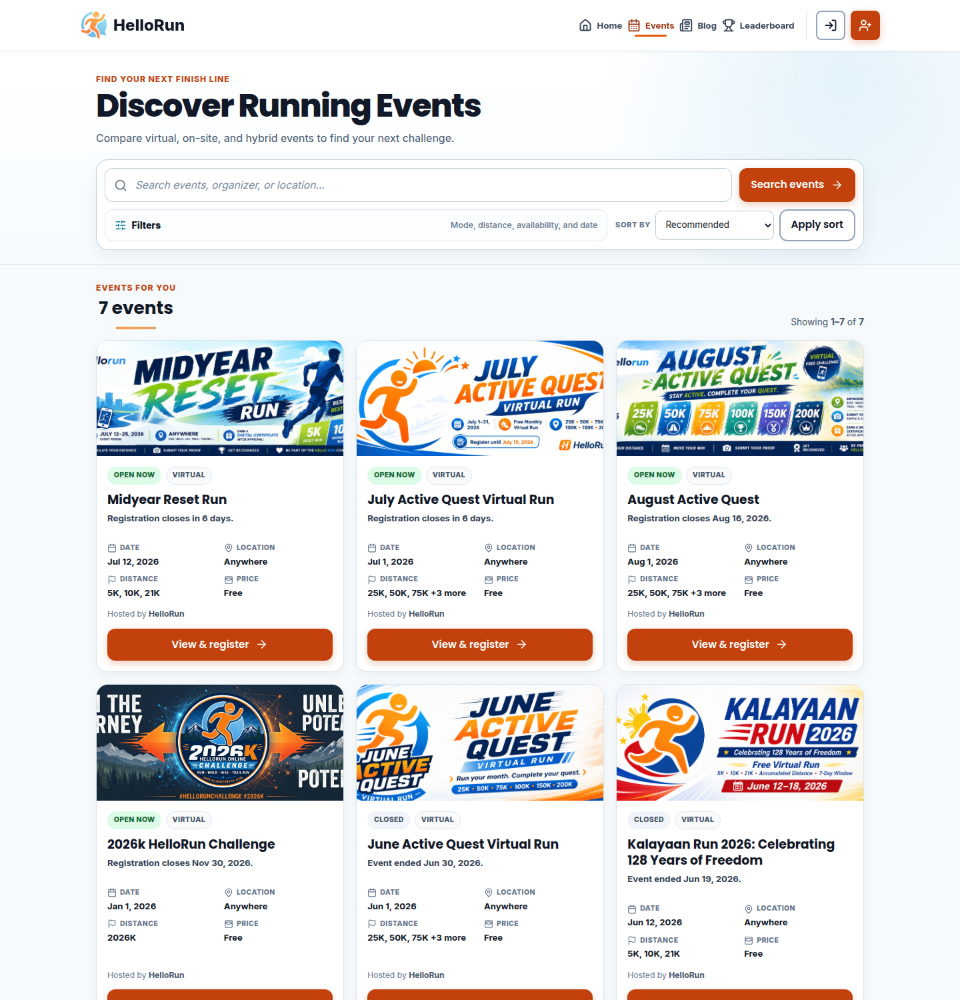
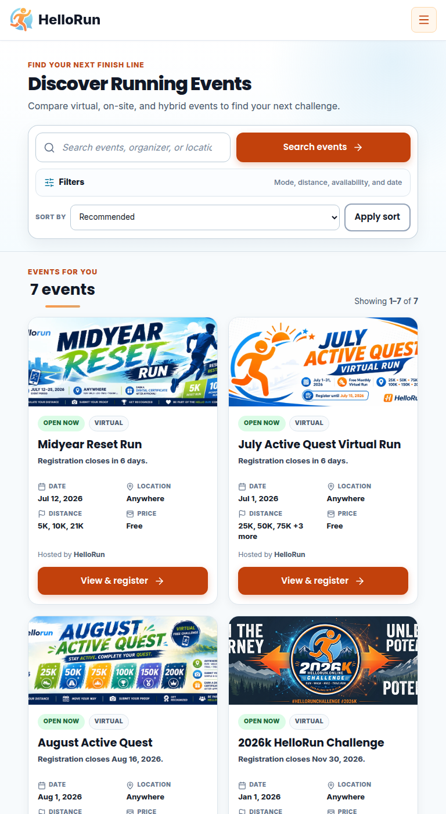
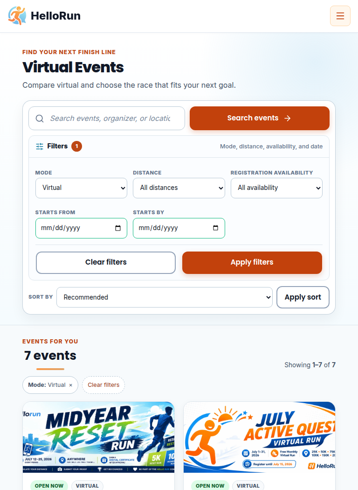
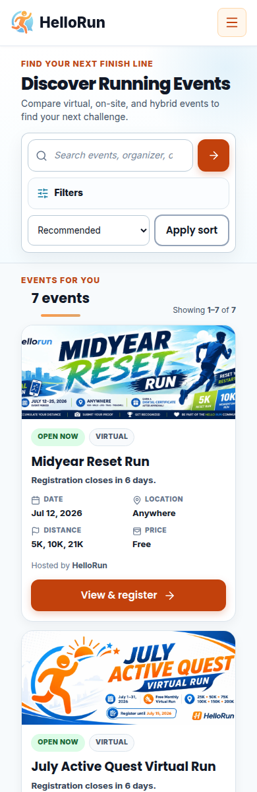
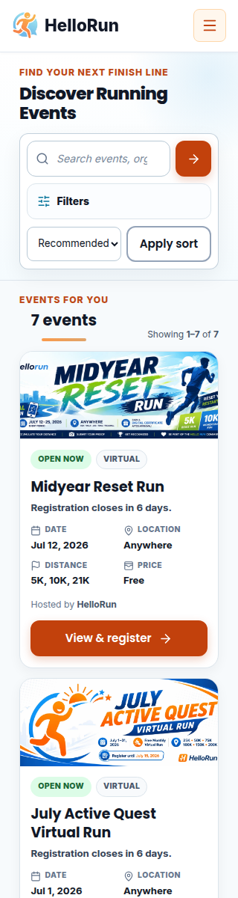

# `/events` UI/UX Analysis — Runner POV

Date: 2026-07-17  
Surface: Public event discovery (`/events`)  
Primary audience: Casual and returning runners using phones, tablets, and desktops

## Runner goal

The runner arrives with one practical question: **“Which event can I join, and does it fit me?”** They need to compare availability, event date, location, distance, and price before opening an event for its full rules. Discovery should therefore lead with searchable results and make those five decision signals consistent across every card.

The successful path is:

`arrive → search or narrow → compare key facts → open event → decide/register`

## Findings and resolution

| Severity | Runner POV | Previous friction | Resolution |
|---|---|---|---|
| P0 | “Can I join this?” | Upcoming, Open, and Closed/Past mixed event timing with registration timing and could overlap. | One availability resolver now produces mutually exclusive Open now, Opens later, or Closed states for filters, ordering, badges, helper copy, and CTA text. |
| P1 | “Show me events.” | A large hero, interface statistics, repeated headings, full filters, and saved-view controls delayed the first result—especially on mobile. | A compact intro and search lead directly to results; filters are disclosed only when requested or already active. Operational saved-view tools no longer run on public pages. |
| P1 | “Is this event right for me?” | Cards combined five metadata rows with organizer and multi-line description, making comparison slow and card heights unpredictable. | Cards now prioritize date, location, distance, and price; descriptions remain on event details. Long distance collections use a compact visible summary while assistive technology receives the full value. |
| P1 | “Why is this event first?” | “Recommended order” was explanatory text rather than a usable control, and the default order favored recently created records inside broad groups. | Recommended ordering favors actionable availability and the nearest deadline/opening. Runners can explicitly sort by closing soon, event date, or newest listed. |
| P2 | “What did I filter?” | Server-rendered chips and a global JavaScript enhancement duplicated filter feedback and offered an unexplained Save This View action. | One authoritative set of removable chips is shown. Clearing filters retains sort because sort is not treated as a filter. |
| P2 | “Can I use this on my phone or keyboard?” | Touch sizing was generally sound, but the filter stack dominated the mobile viewport. | Search, filter disclosure, and sort remain keyboard-operable and at least 44 px high; the default mobile state reaches the first event without expanding filters. |

## Design rationale

- The event detail page remains the trust and registration decision surface. Discovery cards provide enough information to choose what to inspect without duplicating rules or marketing descriptions.
- Search, filtering, sorting, pagination, and removable chips remain server-rendered URLs. Links can be shared, browser navigation works normally, and the page remains functional without JavaScript.
- The visual grid preserves event artwork and community energy while the two-column fact block makes repeated information scannable.
- Open events use the strongest action language (“View & register”), future registration uses “View event,” and closed events use “View recap.” All actions still open the event detail page.
- Authenticated runners retain event saving and My Registrations access. Saved filter views were excluded because they serve operational queue work better than occasional public discovery.

## Responsive reference

### Desktop — 1440 px

### Tablet — 768 px

Expanded filters keep the full tablet width so labels, inputs, and actions remain aligned instead of competing with sorting for the same row.

### Mobile — 390 px

### Small mobile — 320 px

## Acceptance criteria

- Search and the collapsed filter/sort controls precede the results; no interface-statistics panel or saved-view control appears.
- The default 390 px layout shows the first event card within the initial discovery scroll, without horizontal overflow.
- Desktop, tablet, and mobile use three, two, and one result columns respectively.
- Every card exposes availability, mode, title, one timing helper, date, location, compact distance, price, organizer, and one status-aware CTA.
- The full distance value remains available to screen readers when the visible value is shortened.
- `status=open`, `status=upcoming`, and `status=closed` return mutually exclusive registration states.
- Recommended ordering is Open now → Opens later → Closed, with the nearest relevant action date first inside each group.
- `sort=recommended|closing-soon|start-date|newest` survives filters and pagination; invalid values normalize to Recommended.
- Clearing filters retains a non-default sort, while canonical URLs omit sort-only variants.
- Filters open automatically when active or invalid, date errors are announced, touch targets are at least 44 px, focus is visible, and reduced-motion preferences are respected.

## Validation approach

The implementation is covered by template/source tests, event-list service tests, and the public search/filter smoke suite. Manual review targets 1440, 768, 390, and 320 px, plus keyboard navigation, 200% zoom, reduced motion, long values, missing images, authenticated save controls, filtered empty states, and invalid date ranges.
